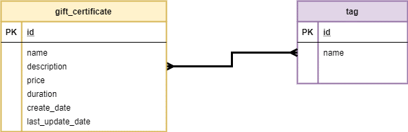

# SpringTask

1. Business requirements

## TASK 1

-	CreateDate, LastUpdateDate - format ISO 8601 (https://en.wikipedia.org/wiki/ISO_8601). Example: 2018-08-29T06:12:15.156. More discussion here: https://stackoverflow.com/questions/3914404/how-to-get-current-moment-in-iso-8601-format-with-date-hour-and-minute
-	Duration - in days (expiration period)
2.	The system should expose REST APIs to perform the following operations:
-	CRUD operations for GiftCertificate. If new tags are passed during creation/modification – they should be created in the DB. For update operation - update only fields, that pass in request, others should not be updated. Batch insert is out of scope.
-	CRUD operations for Tags.
-	Get certificates with tags (all params are optional and can be used in conjunction):
  ▪	by tag name (ONE tag)
  ▪	search by part of name/description (can be implemented, using DB function call)
  ▪	sort by date or by name ASC/DESC (extra task: implement ability to apply both sort type at the same time).

 	Application requirements
1.	JDK version: 17 – use Streams, java.time.*, etc. where it is possible.
2.	Any widely-used connection pool could be used.
3.	Spring JDBC Template should be used for data access.
4.	Use transactions where it’s necessary.
5.	Build tool: Maven, latest version.
6.	Web server: Apache Tomcat.
7.	Application container: Spring IoC. Spring Framework, the latest version.
8.	Database: PostgreSQL.
9.	Testing: JUnit 5.+, Mockito.
10.	Service layer should be covered with unit tests not less than 80%.
11.	Repository layer should be tested using integration tests with an in-memory embedded database (all operations with certificates).
12.	As a mapper use Mapstruct.
13.	Use lombok.

  General requirements
1.	Code should be clean and should not contain any “developer-purpose” constructions.
2.	App should be designed and written with respect to OOD and SOLID principles.
3.	Code should contain valuable comments where appropriate.
4.	Public APIs should be documented (Javadoc).
5.	Clear layered structure should be used with responsibilities of each application layer defined.
6.	JSON should be used as a format of client-server communication messages.
7.	Convenient error/exception handling mechanism should be implemented: all errors should be meaningful on backend side. 
8.	Abstraction should be used everywhere to avoid code duplication.

## TASK 2

  Business requirements
  
This sub-module is an extension of REST API Basics, and it covers such topics as pagination, sorting, filtering. 
Please imagine that your application has a lot of data, so when you make a GET request it will return, for instance, 1 million records.
This will take much time to process such request and return the result to the consumer of your API. 
That is exactly what pagination, sorting, and filtering can solve. The system should be extended to expose the following REST APIs:

1.	Change single field of gift certificate (e.g. implement the possibility to change only duration of a certificate or only price).
2.	Add new entity User.
o	implement only get operations for user entity.
3.	Make an order on gift certificate for a user (user should have an ability to buy a certificate).
4.	Get information about user’s orders.
5.	Get information about user’s order: cost and timestamp of a purchase.
  -	The order cost should not be changed if the price of the gift certificate is changed.
6.	Get the most widely used tag of a user with the highest cost of all orders.
  - Create separate endpoint for this query.
  -	Demonstrate SQL execution plan for this query (explain).
7.	SeApplication requirements
1.	JDK version: 17. Use Streams, java.time.*, an etc. where it is appropriate. (the JDK version can be increased in agreement with the coordinator/run coordinator)
2.	Application packages root: ru.clevertec.ecl.
3.	Search for gift certificates by several tags (“and” condition).
4.	Pagination should be implemented for all GET endpoints. Please, create a flexible and non-erroneous solution. Handle all exceptional cases.
5.	Java Code Convention is mandatory (exception: margin size –120 characters).
6.	Maven, latest version.
7.	Spring Boot, the latest version.
8.	Database: PostgreSQL, latest version.
9.	Testing: JUnit, the latest version, Mockito.
10.	Service layer should be covered with unit tests not less than 80%.

